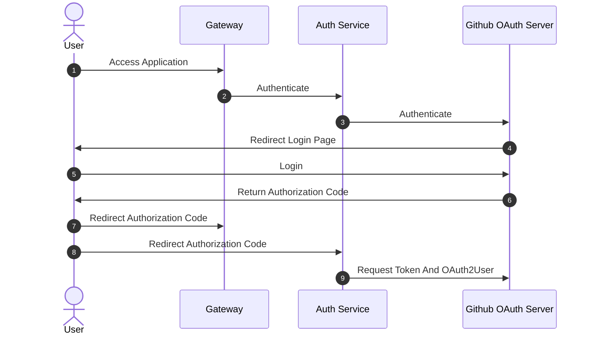
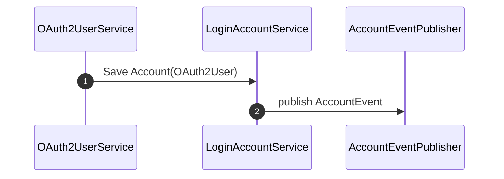
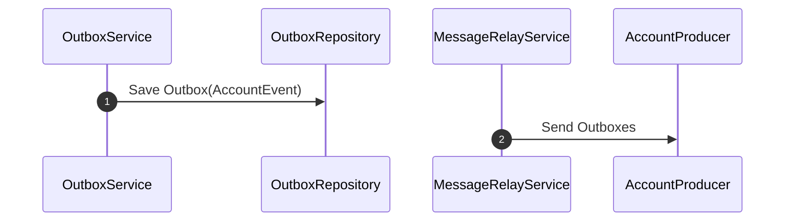

## 용어
### 계정
| 한글명 | 영문명 | 설명 |
| --- | --- | --- |
| 계정명 | userName | OAuth2 Provider 에서 사용하는 식별자 (ex. 955620) |
| 사용자명 | name | OAuth2 Provider 에 등록된 사용자명 (ex. mandykr) |

## 모델링
### 계정(`Account`)
- 계정은 식별자와 계정명, 사용자명, 이메일, 사용자 권한을 가진다.

#### OAuth2

#### Account

#### Account Event

